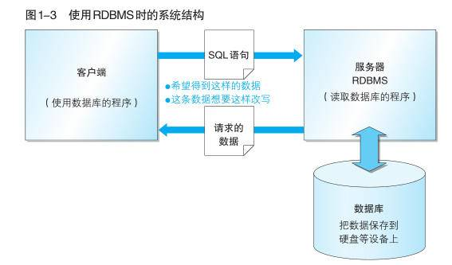
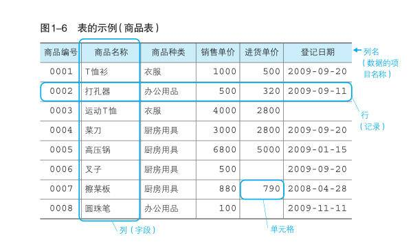

# 第一章：初识数据库


## 1. Mysql下载与连接

mysql下载可以参考CSDN链接[链接](https://blog.csdn.net/weixin_39289696/article/details/128850498)

数据库的连接有多种方式，因为pycharm的原因，我选择了Datagrip。这个[视频](https://www.bilibili.com/video/BV1wq4y1Y775/?spm_id_from=333.337.search-card.all.click)对datagrip的基本操作给出介绍


## 2. 数据库的常识

### 2.1 基本概念

**数据**（Data）：描述事物的符号记录

**数据库**（Database，**DB**）：通过计算机加工而成的可以进行高效访问的数据集合

**数据库管理系统**（Database Management System，**DBMS**）：用来管理数据库的计算机系统称为数据库管理系统

**数据库系统**（**DBS**）：数据库、数据库管理系统（及其应用开发工具）、应用程序和数据库管理员组成的存储、管理、处理和维护数据的系统。


### 2.2 DBMS的分类

DBMS 主要通过数据的保存格式（数据库的种类）来进行分类，现阶段主要有以下 5 种类型.

- 层次数据库（Hierarchical Database，HDB）

- 关系数据库（Relational Database，RDB）

  - Oracle Database：甲骨文公司的RDBMS
  - SQL Server：微软公司的RDBMS
  - DB2：IBM公司的RDBMS
  - PostgreSQL：开源的RDBMS
  - MySQL：开源的RDBMS

  如上是5种具有代表性的RDBMS，其特点是由<u>行和列组成的二维表来管理数据</u>，这种类型的 DBMS 称为关系数据库管理系统（Relational Database Management System，RDBMS）。

- 面向对象数据库（Object Oriented Database，OODB）

- XML数据库（XML Database，XMLDB）

- 键值存储系统（Key-Value Store，KVS），举例：MongoDB


### 2.3 RDMBS 常见系统结构

最常见的系统结构就是客户端 / 服务器类型（C/S类型）这种结构（如下所示）




## 3. SQL语言

### 3.1 基本介绍

- 数据库中存储的表结构类似于excel中的行和列，在数据库中，行称为**记录**，列称为**字段**，行和列交汇的地方称为单元格，一个单元格中只能输入一条记录。（见下图）



- 国际标准化组织（ISO）为 SQL 制定了相应的标准，以此为基准的SQL 称为标准 SQL。<u>完全基于标准 SQL 的 RDBMS 很少，通常需要根据不同的 RDBMS 来编写特定的 SQL 语句</u>。Datawhale课程介绍的是标准 SQL 的书写方式。
- SQL语句分类
  - **DDL**（Data Definition Language，数据定义语言）：用来创建或者删除存储数据用的数据库以及数据库中的表等对象
    - CREATE：创建数据库和表对象
    - DROP：删除数据库和表等对象
    - ALTER： 修改数据库和表等对象的结构
  - **DML**（Data Manipulation Language，数据操纵语言） 用来查询或者变更表中的记录（ SQL 语句当中有 90% 属于 DML）
    - SELECT ：查询表中的数据
    - INSERT ：向表中插入新数据
    - UPDATE ：更新表中的数据
    - DELETE ：删除表中的数据
  - **DCL**（Data Control Language，数据控制语言） 用来确认或者取消对数据库中的数据进行的变更
    - COMMIT ： 确认对数据库中的数据进行的变更
    - ROLLBACK ： 取消对数据库中的数据进行的变更
    - GRANT ： 赋予用户操作权限
    - REVOKE ： 取消用户的操作权限


### 3.2 书写规范

这个多写写应该就记住了，可以参考datawhale给出的[规范](https://github.com/datawhalechina/wonderful-sql/blob/main/materials/附录1：SQL语法规范.md)


###3.3 数据库创建

```sql
-- 语法
CREATE DATABASE < 数据库名称 > ;
-- 例子
CREATE DATABASE shop;
```


### 3.4 表的操作

#### 3.4.1 操作语法

**增加**

```sql
/*   创建表格   */
-- 语法
CREATE TABLE < 表名 >
( < 列名1 > < 数据类型 > < 该列所需约束 >,
  < 列名2 > < 数据类型 > < 该列所需约束 >,
  < 列名3 > < 数据类型 > < 该列所需约束 >,
  < 列名4 > < 数据类型 > < 该列所需约束 >,
  .
  .
  < 该表的约束1 >， < 该表的约束2 >,...);
-- 例子
CREATE TABLE product
(product_id CHAR(4) NOT NULL,
 product_name VARCHAR(100) NOT NULL,
 product_type VARCHAR(32) NOT NULL,
 sale_price INTEGER,
 purchase_price INTEGER,
 regist_date DATE,
 PRIMARY KEY (product_id));
 
 /*    创建列   */
 -- 语法
 ALTER TABLE < 列名 > ADD COLUMN < 列的定义 >;
 -- 例子
 ALTER TABLE product ADD COLUMN product_name_pinyin VARCHAR(100);
```

**删除**

```sql
/*   删除表格   */
-- 语法
DROP TABLE < 表名 >;
-- 例子
DROP TABLE product;

/*    删除列    */
-- 语法
ALTER TABLE < 表名 > DROP COLUMN < 列名 > ;
-- 例子
ALTER TABLE product DROP COLUMN product_name_pinyin;

/*   删除特定行  */
DELETE FROM product WHERE COLUMN_NAME = 'XXX';
# ALTER TABLE 语句和 DROP TABLE 语句一样，执行之后无法恢复。误添加的列可以通过 ALTER TABLE 语句删除，或者将表全部删除之后重新再创建。

/*    清空表    */
TRUNCATE TABLE < 表名 >
# 相比drop / delete，truncate用来清除数据时，速度最快
```

**更新**（记录）

```sql
/*    语法    */
UPDATE < 表名 >
   SET < 列名 > = < 表达式 > [, < 列名2 > = < 表达式2 > ...]
 WHERE < 条件 > --可选
 ORDER BY 子句 --可选
 LIMIT 子句； --可选


/*    例子    */
-- 更新所有记录
UPDATE product
   SET regist_date = '2009-10-10';
-- 仅修改部分
UPDATE product
   SET sale_price = sale_price * 10
 WHERE product_type = '厨房用具';
-- 更新为NULL
UPDATE product
   SET regist_date = NULL   #只有未设置 NOT NULL 约束和主键约束的列才可以清空为NULL
 WHERE product_id = '0008';

/*   多列更新   */
-- 基础写法
UPDATE product
   SET sale_price = sale_price * 10
 WHERE product_type = '厨房用品';
UPDATE product
   SET purchase_price = purchase_price / 2
 WHERE product_type = '厨房用具';  
-- 合并写法
UPDATE product
   SET sale_price = sale_price * 10
       purchase_price = purchase_price / 2
 WHERE product_type = '厨房用具';
```

**插入**（记录）

```sql
-- 先创建一个对象
CREATE TABLE productins
(product_id    CHAR(4)      NOT NULL,
product_name   VARCHAR(100) NOT NULL,
product_type   VARCHAR(32)  NOT NULL,
sale_price     INTEGER      DEFAULT 0,
purchase_price INTEGER ,
regist_date    DATE ,
PRIMARY KEY (product_id)); 

/*     语法     */
INSERT INTO < 表名 > (列1, 列2, ...) VALUES(值1, 值2, ...)

/*     例子     */
-- 包含列清单
INSERT INTO productins (product_id, product_name, product_type, sale_price, purchase_price, regist_date) VALUES ('0005', '高压锅', '厨房用具', 6800, 5000, '2009-01-15');
-- 省略列清单
INSERT INTO productions VALUES  ('0005', '高压锅', '厨房用具', 6800, 5000, '2009-01-15');
-- 赋值NULL
INSERT INTO productins VALUES ('0006', '叉子', '厨房用具', 500, NULL, '2009-09-20');  

/*    插入多行    */
-- 通常
INSERT INTO productins VALUES ('0002', '打孔器', '办公用品', 500, 320, '2009-09-11');
INSERT INTO productins VALUES ('0003', '运动T恤', '衣服', 4000, 2800, NULL);
INSERT INTO productins VALUES ('0004', '菜刀', '厨房用具', 3000, 2800, '2009-09-20');
-- 多行INSERT
INSERT INTO productins VALUES ('0002', '打孔器', '办公用品', 500, 320, '2009-09-11'),
                              ('0003', '运动T恤', '衣服', 4000, 2800, NULL),
                              ('0004', '菜刀', '厨房用具', 3000, 2800, '2009-09-20');  


/*  从其他表复制数据  */
INSERT INTO productcopy (product_id, product_name, product_type, sale_price, purchase_price, regist_date)
SELECT (product_id, product_name, product_type, sale_price, purchase_price, regist_date)
  FROM product;


```

课程需要使用的sql数据：

```sql
- DML ：插入数据
STARTTRANSACTION;
INSERT INTO product VALUES('0001', 'T恤衫', '衣服', 1000, 500, '2009-09-20');
INSERT INTO product VALUES('0002', '打孔器', '办公用品', 500, 320, '2009-09-11');
INSERT INTO product VALUES('0003', '运动T恤', '衣服', 4000, 2800, NULL);
INSERT INTO product VALUES('0004', '菜刀', '厨房用具', 3000, 2800, '2009-09-20');
INSERT INTO product VALUES('0005', '高压锅', '厨房用具', 6800, 5000, '2009-01-15');
INSERT INTO product VALUES('0006', '叉子', '厨房用具', 500, NULL, '2009-09-20');
INSERT INTO product VALUES('0007', '擦菜板', '厨房用具', 880, 790, '2008-04-28');
INSERT INTO product VALUES('0008', '圆珠笔', '办公用品', 100, NULL, '2009-11-11');
COMMIT;
```

#### 3.4.2 命名规则

* 只能使用半角英文字母、数字、下划线（_）作为数据库、表和列的名称
* 名称必须以半角英文字母开头

#### 3.4.3 数据类型

四种最基本的数据类型

- **INTEGER**：用来指定存储整数的列的数据类型（数字型），不能存储小数
- **CHAR**：用来存储定长字符串，当列中存储的字符串长度达不到最大长度的时候，使用半角空格进行补足，由于会浪费存储空间，所以一般不使用。
- **VARCHAR**：用来存储可变长度字符串，定长字符串在字符数未达到最大长度时会用半角空格补足，但可变长字符串不同，即使字符数未达到最大长度，也不会用半角空格补足。
- **DATE**：用来指定存储日期（年月日）的列的数据类型（日期型）。

#### 3.4.4 约束

`NOT NULL` 非空约束

`PRIMARY KEY` 主键约束

#### 3.4.5 索引

因为datawhale的介绍不是很详细，可以参考这篇[文章](https://developer.aliyun.com/article/831250)

```sql
/*   创建索引     */
-- 方法1
CREATE TABLE mytable (
  ID INTEGER NOT NULL,
  username VARCHAR(16) NOT NULL,
  INDEX [indexname] (useername(length))
);

-- 方法2
CREATE INDEX indexName ON table_name (column_name)

-- 方法3
ALTER table tableName ADD INDEX indexName(columnName)
```

**索引分类**

**主键索引：`primary key`**

- 设定为主键后，数据库自动建立索引，InnoDB为聚簇索引，主键索引列值不能为空（Null）。

**唯一索引：**

- 索引列的值必须唯一，但允许有空值（Null），但只允许有一个空值（Null）。

**复合索引：**

- 一个索引可以包含多个列，多个列共同构成一个复合索引。

**全文索引：**

- Full Text（MySQL5.7之前，只有MYISAM存储引擎引擎支持全文索引）。
- 全文索引类型为FULLTEXT，在定义索引的列上支持值的全文查找允许在这些索引列中插入重复值和空值。全文索引可以在**Char、VarChar** 上创建。

**空间索引：**

- MySQL在5.7之后的版本支持了空间索引，而且支持OpenGIS几何数据模型，MySQL在空间索引这方年遵循OpenGIS几何数据模型规则。

**前缀索引：**

- 在文本类型为char、varchar、text类列上创建索引时，可以指定索引列的长度，但是数值类型不能指定。


## 参考文章

[wonderful-sql/ch01:初识数据库.md at main · datawhalechina/wonderful-sql (github.com)](https://github.com/datawhalechina/wonderful-sql/blob/main/ch01%3A初识数据库.md)

[MySQL数据库下载及安装教程（最最新版）_mysql下载安装-CSDN博客](https://blog.csdn.net/weixin_39289696/article/details/128850498)

https://www.bilibili.com/video/BV1wq4y1Y775/?spm_id_from=333.337.search-card.all.click

[MySQL索引详解（一文搞懂）-阿里云开发者社区 (aliyun.com)](https://developer.aliyun.com/article/831250)