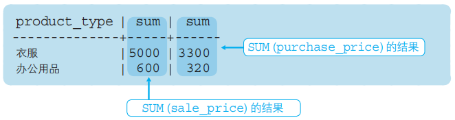

# 第二章： 基础查询与排序

## 1. SELECT 语句

目的：SELECT可以从表中选取必要数据，WHERE子句来指定查询数据的条件

```sql
-- 基本语法
SELECT < 列名1 >, ...
  FROM < 表名 >
 WHERE < 条件表达式>;

-- 例子
SELECT product_name, product_type
  FROM product
 WHERE product_type = '衣服';

/*   一些零碎的信息   */
-- “*” 用来代表取全部列信息
SELECT * 
  FROM < 表名 >;

-- SQL可以使用关键词 AS 为列设置别名，中文别名需要双引号括起来
SELECT product_id    AS id,
       product_name  AS name,
       product_price AS "进货单价"
  FROM product;

-- 在SELECT中使用 DISTINCT 可以删除重复行
SELECT DISTINCT product_type
  FROM product;
```


## 2. 运算符

### 2.1 算术运算符

| 含义 | 运算符 |
| :--- | :----- |
| 加法 | +      |
| 减法 | -      |
| 乘法 | *      |
| 除法 | /      |

### 2.2 比较运算符

| 运算符 | 含义        |
| :----- | :---------- |
| =      | 和 ~ 相等   |
| <>     | 和 ~ 不相等 |
| >=     | 大于等于 ~  |
| >      | 大于 ~      |
| <=     | 小于等于 ~  |
| <      | 小于 ~      |

```sql
-- SELECT语句中可以使用运算表达式
SELECT product_name, sale_price * 2 AS "sale_price x2"
  FROM product;

-- WHERE语句中可以使用运算表达式
SELECT product_name, sale_price * 2 AS "sale_price x2"
  FROM product
 WHERE sale_price - puerchase_price >= 500;

-- 选取NULL的记录
SELECT product_name, purchase_price
  FROM product
 WHERE purchase_price IS NULL;
-- 选取不为NULL的记录
SELECT product_name, purchase_price
  FROM product
 WHERE purchase_price IS NOT NULL;
```

### 2.3 逻辑运算符

| 关键字 | 含义 |
| :----- | :--- |
| NOT    | 否   |
| AND    | 且   |
| OR     | 或   |

```sql
-- 否运算举例
SELECT product_name, product_type, sale_price
  FROM product
 WHERE NOT sale_price >= 1000;

-- “商品种类为办公用品”并且“登记日期是2009年9月11日或者2009年9月20日”
SELECT product_name, product_type, regist_date
  FROM product
 WHERE product_type = '办公用品'
   AND ( regist_date = '2009-09-11'
        OR regist_date = '2009-09-20')

-- 当有NULL值参与 AND 和 OR 的运算时，结果均为NULL
```


## 3. 聚合查询

SQL中用于汇总的函数叫做**聚合函数**。以下五个是最常用的聚合函数：

- **SUM**：计算表中某数值列中的合计值

- **AVG**：计算表中某数值列中的平均值

- **MAX**：计算表中任意列中数据的最大值，包括文本类型和数字类型

- **MIN**：计算表中任意列中数据的最小值，包括文本类型和数字类型

- **COUNT**：计算表中的记录条数（行数）

```sql
-- 例子
SELECT SUM(sale_price), AVG(purchase_price), MAX(sale_price), MIN(sale_price)
  FROM product;

-- 可以使用DISTINCT删除重复
SELECT COUNT(DISTINCT product_type)
  FROM product;

-- 聚合函数不处理包含 NULL 值的行，但是 COUNT(*) 除外
-- 计算全部数据的行数（包含 NULL 所在行）
SELECT COUNT(*)
  FROM product;
-- 计算 NULL 以外数据的行数
SELECT COUNT(purchase_price)
  FROM product;
```


## 4. 分组

```sql
-- 语法
SELECT <列名1>,<列名2>, <列名3>, ……
  FROM <表名>
 GROUP BY <列名1>, <列名2>, <列名3>, ……;

-- GROUP BY 子句中指定的列成为 聚合键 或分组列
-- 聚合键包含NULL 时，会将NULL作为一组特殊数据


-- 使用WHERE子句
-- GROP BY 子句有严格的顺序： SELECT -> FROM -> WHERE -> GROUP BY
SELECT purchase_price, COUNT(*)
  FROM product
 WHERE product_type = '衣服'
 GROUP BY purchase_price;
 
-- 常见错误
-- 1. SELECT 子句中可以通过 AS 来指定别名，但在 GROUP BY 中不能使用别名。因为在 DBMS 中 ,SELECT 子句在 GROUP BY 子句后执行。
-- 2. SELECT 子句中如果出现列名，只能是 GROUP BY 子句中指定的列名（也就是聚合键）
-- 3. 在WHERE子句中使用聚合函数可能会引发错误，因为聚合函数的使用前提是结果集已经确定，而WHERE子句正处于确定结果集的过程中。如果想指定条件来筛选结果集，可以在SELECT、HAVING和ORDER BY子句中使用聚合函数
```


## 5. 为分组结果指定条件

将表使用 GROUP BY 分组后，怎样才能只取出其中两组


WHERE用于指定记录（行）的条件，不能用来指定组的条件。HAVING 子句限定的是分组聚合结果

```sql
-- 常数
SELECT product_type, COUNT(*)
  FROM product
 GROUP BY product_type
HAVING COUNT(*) = 2;

-- 错误形式（因为product_name不包含在GROUP BY聚合键中）
SELECT product_type, COUNT(*)
  FROM product
 GROUP BY product_type
HAVING product_name = '圆珠笔';
```


## 6. 排序

```sql
-- 语法
-- 参数 ASC 表示升序排列，DESC 表示降序排列，默认为升序，此时，参数 ASC 可以缺省
SELECT <列名1>, <列名2>, <列名3>, ……
  FROM <表名>
 ORDER BY <排序基准列1> [ASC, DESC], <排序基准列2> [ASC, DESC], ……


-- 例子
SELECT product_id, product_name, sale_price, purchase_price
  FROM product
 ORDER BY sale_price, product_id;


-- 别名使用问题
-- SQL 语句执行顺序： FROM -> WHERE -> GROUP BY -> SELECT -> HAVING -> ORDER BY
-- ORDER BY 在 SELECT 执行以后，结果确定下来，所以可以使用别名


-- NULL
-- NULL值被认为比任何非NULL值低（可以理解为-INF，但是加了-依然不改变）。 当ASC时，NULL出现在第一位；当DESC时，NULL出现最后。

/*   1. NULL在末行，非NULL按照升序   */
-- 常用方法
SELECT * FROM user 
 ORDER BY -date_login DESC;

-- 列中的元素为字符，不一定能得到期望的排序结果，可以修改为
-- IS NULL
SELECT * FROM user 
 ORDER BY name IS NULL ASC,name ASC;
-- ISNULL()
SELECT * FROM user 
 ORDER BY ISNULL(name) ASC,name ASC;
-- COALESCE 函数
SELECT * FROM user 
 ORDER BY COALESCE(name, 'zzzzz') ASC;
 
/*   2. NULL在首行，非NULL按照降序   */
-- 基本
SELECT * FROM user 
 ORDER BY -date_login ASC;
-- IS NOT NULL
SELECT * FROM user 
 ORDER BY name IS NOT NULL ASC,name DESC;
-- !ISNULL()
SELECT * FROM user 
 ORDER BY !ISNULL(name) ASC,name DESC;
-- COALESCE
SELECT * FROM user 
 ORDER BY COALESCE(name, 'zzzzz') DESC;
```


## 课后题目答案

### 2.1

**题目**：编写一条SQL语句，从 `product`(商品) 表中选取出“登记日期(`regist_date`)在2009年4月28日之后”的商品，查询结果要包含 `product name` 和 `regist_date` 两列。

**答案**

```sql
SELECT product_name, regist_date
  FROM product
 WHERE regist_date > '2009-04-28';
```

### 2.2

**题目**：请说出对product 表执行如下3条SELECT语句时的返回结果。

①

```sql
SELECT *
  FROM product
 WHERE purchase_price = NULL;
```

②

```sql
SELECT *
  FROM product
 WHERE purchase_price <> NULL;
```

③

```sql
SELECT *
  FROM product
 WHERE product_name > NULL;
```

**答案**：三条SELECT什么都不会返回，因为涉及到NULL的逻辑运算结果都是NULL，没有正值结果

### 2.3

**题目**：请写出两条可以得到相同结果的SELECT语句。执行结果如下所示：

```sql
product_name | sale_price | purchase_price 
-------------+------------+------------
T恤衫        | 　 1000    | 500
运动T恤      |    4000    | 2800
高压锅       |    6800    | 5000
```

**答案**：(看了参考答案，区别就是左右移动WHERE的项，感觉没啥区别)

```sql
SELECT product_name, sale_price, purchase_price 
  FROM product
 WHERE sale_price - purchase_price >= 500;
```

### 2.4

**题目**：请写出一条SELECT语句，从 `product` 表中选取出满足“销售单价打九折之后利润高于 `100` 日元的办公用品和厨房用具”条件的记录。查询结果要包括 `product_name`列、`product_type` 列以及销售单价打九折之后的利润（别名设定为 `profit`）。

提示：销售单价打九折，可以通过 `sale_price` 列的值乘以0.9获得，利润可以通过该值减去 `purchase_price` 列的值获得。

**答案**：

```sql
SELECT product_name, product_type, sale_price * 0.9 - purchase_price AS profit
  FROM product
 WHERE sale_price * 0.9 - purchase_price > 100;
```

### 2.5

**题目**：请指出下述SELECT语句中所有的语法错误。

```sql
SELECT product_id, SUM（product_name）
--本SELECT语句中存在错误。
  FROM product 
 GROUP BY product_type 
 WHERE regist_date > '2009-09-01';
```

**答案**：1. SELECT 中不选筛选 product_id，因为它不在GROUP BY的聚合键里面；2. WHERE需要在GROUP BY之前

### 2.6

**题目**：请编写一条SELECT语句，求出销售单价（ `sale_price` 列）合计值大于进货单价（ `purchase_price` 列）合计值1.5倍的商品种类。执行结果如下所示。

```sql
product_type | sum  | sum 
-------------+------+------
衣服         | 5000 | 3300
办公用品      |  600 | 320
```



**答案**：

```sql
SELECT product_type, SUM(sale_price) AS SUM1,SUM(purchase_price) AS SUM2
  FROM product
 GROUP BY product_type
HAVING SUM1 > 1.5 * SUM2;
 
```

### 2.7

**题目**：此前我们曾经使用SELECT语句选取出了product（商品）表中的全部记录。当时我们使用了 `ORDER BY` 子句来指定排列顺序，但现在已经无法记起当时如何指定的了。请根据下列执行结果，思考 `ORDER BY` 子句的内容。


**答案**：

```sql
SELECT *
    FROM product
ORDER BY - regist_date , sale_price;
```


## 参考

[wonderful-sql/ch02:基础查询与排序.md at main · datawhalechina/wonderful-sql (github.com)](https://github.com/datawhalechina/wonderful-sql/blob/main/ch02%3A基础查询与排序.md)