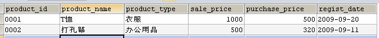
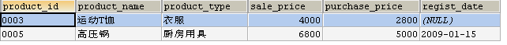
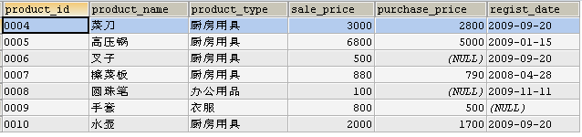

#第四章：集合运算

[TOC]

## 一、 表的加减法

```sql
-- 该部分数据
CREATE table product
(
    product_id   CHAR(4)      NOT NULL,
    product_name VARCHAR(100) NOT NULL,
    PRIMARY KEY (product_id)
);
INSERT INTO product
values ('0001', 'T恤衫'),
       ('0002', '打孔器'),
       ('0003', '运动T恤'),
       ('0004', '菜刀'),
       ('0005', '高压锅'),
       ('0006', '叉子'),
       ('0007', '擦菜板'),
       ('0008', '圆珠笔');
       
CREATE table product2
(
    product_id   CHAR(4)      NOT NULL,
    product_name VARCHAR(100) NOT NULL,
    PRIMARY KEY (product_id)
);
INSERT INTO product2
values ('0001', 'T恤衫'),
       ('0002', '打孔器'),
       ('0003', '运动T恤'),
       ('0009', '手套'),
       ('0010', '水壶');
```

### 1.1表的加法--UNION

#### 1.1.1 以一个例子展示UNION的具体用法

UNION 等集合运算符通常都会除去重复的记录

```sql
SELECT product_id, product_name
  FROM product
 UNION
SELECT product_id, product_name
  FROM product2;
```

#### 1.1.2 上述查询是对两个表求并集运算，对同一张表也可以使用

假设连锁店想要增加成本利润率超过 50% 或者售价低于 800 的货物的存货量，请使用 UNION 对分别满足上述两个条件的商品的查询结果求并集。(结果见下图)


```sql
SELECT product_id, product_name, product_type, sale_price, purchase_price
  FROM product
 WHERE sale_price <800
 
 Union
 
SELECT product_id, product_name, product_type, sale_price, purchase_price
  FROM product
 WHERE sale_price > purchase_price * 1.5
```

#### 1.1.3 UNION 与 OR 谓词

对于**同一个表的两个不同的筛选结果集**，使用 UNION 对两个结果集取并集，和把两个子查询的筛选条件用  OR 谓词连接，会得到相同的结果，但倘若要将**两个不同的表**中的结果合并在一起，就不得不使用 UNION 了。

#### 1.1.4 包含重复行的集合运算 UNION ALL

SQL 语句的 UNION 会对两个查询的结果集进行合并和去重，这种去重不仅会去掉两个结果集相互重复的，还会去掉一个结果集中的重复行。但在实践中有时候需要需要不去重的并集。

以下给出保留重复行的例子

```sql
SELECT product_type
  FROM product
 UNION ALL
SELECT product_type
  FROM product2;
```

#### 1.1.5 隐式数据转换

通常来说, 我们会把类型完全一致，并且代表相同属性的列使用 UNION 合并到一起显示，但有时候，即使数据类型不完全相同，也会通过隐式类型转换来将两个类型不同的列放在一列里显示

例如，字符转数值类型

```sql
SELECT product_id, product_name, '1'
  FROM product
 UNION
SELECT product_id, product_name,sale_price
  FROM product2;
```

结果如下所示：


### 1.2 交集运算符--INTERSECT

#### 1.2.1 基本用法

截止到 MySQL 8.0.30 版本不支持 `INTERSECT` 操作；MySQL 8.0.31 支持 `INTERSECT`。

需要注意的是：

	1. 使用 `INTERSECT` 运算符进行交集运算的**两张表的列数必须相同，字段类型也需要相同**
	1. `INTERSECT` 运算符优先级高于 `UNION` 和 `EXCEPT`

一个使用的例子：

```sql
TABLE product INTERSECT TABLE product2；
```

#### 1.2.2 INNER JOIN 替代求交集

可以使用 `INNER JOIN` 替代求交集（更具体的介绍见下面连结部分）

```sql
SELECT p1.product_id, p1.product_name
  FROM product p1
INNER JOIN product2 p2
ON p1.product_id=p2.product_id;
```

#### 1.2.3 INTERSECT 与 AND

对于同一个表的两个查询结果而言，他们的交INTERSECT实际上可以等价地将两个查询的检索条件用AND谓词连接来实现。

使用AND谓词查找product表中利润率高于 50%，并且售价低于 1500 的商品，查询结果如下所示。



```sql
SELECT * 
  FROM product
 WHERE sale_price > 1.5 * purchase_price 
   AND sale_price < 1500;

SELECT * 
  FROM product
 WHERE sale_price > 1.5 * purchase_price 
INTERSECT
SELECT * 
  FROM product
 WHERE sale_price < 1500; 
```


### 1.3 差集 -- EXCEPT

MySQL 8.0.31 之前的版本不支持 表的减法运算符 EXCEPT

#### 1.3.1一个使用的例子

```sql
TABLE product EXCEPT TABLE product2;
```

#### 1.3.2 EXCEPT 与NOT

使用 NOT IN 谓词，基本上可以实现和SQL标准语法中的EXCEPT运算相同的效果。

例题：使用NOT谓词进行集合的减法运算，求出 product 表中，售价高于2000、成本利润率不低于 30% 的商品，结果应该如下表所示。



```sql
SELECT * 
  FROM product
 WHERE sale_price > 2000 
   AND product_id NOT IN (SELECT product_id 
                            FROM product 
                           WHERE sale_price < 1.3*purchase_price);

SELECT * 
  FROM product
 WHERE sale_price > 2000 
EXCEPT (SELECT product_id 
          FROM product 
         WHERE sale_price < 1.3*purchase_price);
```


### 1.4 对称差

两个集合 A、B 的对称差是指那些仅属于A或仅属于B的元素构成的集合。两个集合的对称差等于 `A-B` 并上 `B-A`

例题，使用product表和product2表的对称差来查询哪些商品只在其中一张表，结果类似于:



```sql
SELECT * 
  FROM product
 WHERE product_id NOT IN (SELECT product_id FROM product2)
 UNION
SELECT * 
  FROM product2
 WHERE product_id NOT IN (SELECT product_id FROM product);
```


## 2. 连结（JOIN）


## Appendix1：本笔记需要的数据


## Appendix2： 习题答案 


##参考资料