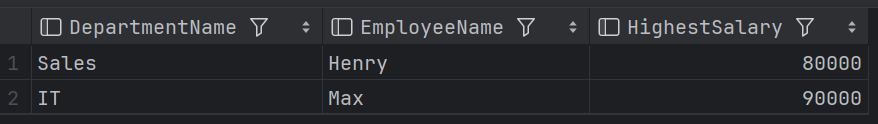
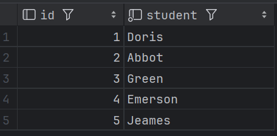
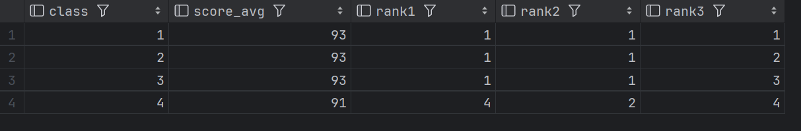
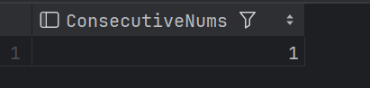
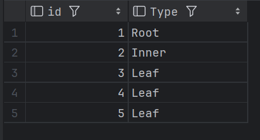
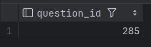

# 第六章--决胜秋招

只写了一部分内容，后期继续补上

## Section A

### 练习一

```sql
-- 建表Employee
CREATE TABLE Employee
(
    Id           INTEGER,
    Name         VARCHAR(20),
    Salary       INTEGER,
    DepartmentId INTEGER,
    PRIMARY KEY (Id)
);

INSERT INTO Employee VALUES (1, 'Joe', 70000, 1),
                            (2, 'Henry', 80000, 2),
                            (3, 'Sam', 60000, 2),
                            (4, 'Max', 90000, 1);
-- 建表 Department
CREATE TABLE Department(
    Id INTEGER,
    Name VARCHAR(20),
    PRIMARY KEY (Id)
);

INSERT INTO Department VALUES (1, 'IT'),
                              (2, 'Sales');
-- 查询               
SELECT 
    d.Name AS DepartmentName,
    e.Name AS EmployeeName,
    e.Salary AS HighestSalary
FROM 
    Department d
JOIN 
    (SELECT 
         DepartmentId, 
         MAX(Salary) AS MaxSalary 
     FROM 
         Employee 
     GROUP BY 
         DepartmentId) AS maxSalaries 
ON 
    d.Id = maxSalaries.DepartmentId
JOIN 
    Employee e 
ON 
    maxSalaries.DepartmentId = e.DepartmentId 
    AND maxSalaries.MaxSalary = e.Salary;

```



### 练习二

```sql
CREATE TABLE seat
(id        INT      NOT NULL ,
student VARCHAR(20) NOT NULL ,
PRIMARY KEY (id));

INSERT INTO seat VALUES(1,'Abbot');
INSERT INTO seat VALUES(2,'Doris');
INSERT INTO seat VALUES(3,'Emerson');
INSERT INTO seat VALUES(4,'Green');
INSERT INTO seat VALUES(5,'Jeames');

SELECT
    CASE WHEN id = (SELECT MAX(id) FROM seat) THEN id
        WHEN MOD(id,2)=1 THEN id+1
        WHEN MOD(id,2)=0 THEN id-1
        ELSE NULL END AS id,
    student
FROM seat
ORDER BY id;
```




### 练习三

```sql
CREATE TABLE score
(class     INT NOT NULL ,
score_avg  INT NOT NULL ,
PRIMARY KEY (class));

INSERT INTO score VALUES(1, 93);
INSERT INTO score VALUES(2, 93);
INSERT INTO score VALUES(3, 93);
INSERT INTO score VALUES(4, 91);

SELECT * FROM score;

-- 按照三种方式排序
SELECT 
      class,
      score_avg,
      RANK() OVER (ORDER BY score_avg DESC) AS rank1,
      DENSE_RANK() OVER (ORDER BY score_avg DESC) AS rank2,
      ROW_NUMBER() OVER (ORDER BY score_avg DESC) AS rank3
FROM  score;


```



### 练习四

```sql
-- 创建表格
CREATE TABLE logs
(id INT NOT NULL ,
num INT NOT NULL ,
PRIMARY KEY (id));

INSERT INTO logs VALUES (1, 1);
INSERT INTO logs VALUES (2, 1);
INSERT INTO logs VALUES (3, 1);
INSERT INTO logs VALUES (4, 2);
INSERT INTO logs VALUES (5, 1);
INSERT INTO logs VALUES (6, 2);
INSERT INTO logs VALUES (7, 2);
SELECT * FROM logs;
-- 查找出现三次的数字

SELECT DISTINCT a.num AS ConsecutiveNums
FROM
    LOGS a, LOGS b, LOGS c
WHERE
    a.id = b.id - 1 AND b.id = c.id - 1 AND a.num = b.num AND b.num = c.num;

```



### 练习五

```sql
## 创建表格
CREATE TABLE tree
(id  INT NOT NULL ,
p_id INT ,
PRIMARY KEY (id));
INSERT INTO tree VALUES (1, null);
INSERT INTO tree VALUES (2, 1);
INSERT INTO tree VALUES (3, 1);
INSERT INTO tree VALUES (4, 2);
INSERT INTO tree VALUES (5, 2);
SELECT * FROM tree;

## 查找树节点
SELECT id,
    CASE WHEN p_id IS NULL THEN 'Root'
        WHEN id IN (SELECT p_id FROM tree) THEN 'Inner'
        ELSE 'Leaf' END AS Type
FROM tree;

```



### 练习六

```sql
## 创建表格
DROP TABLE Employee
CREATE TABLE Employee
(id           INT      NOT NULL ,
name       varchar(20) NOT NULL ,
department varchar(20),
managerid     INT,
PRIMARY KEY (id));

INSERT INTO Employee VALUES (101,  'John', 'A', null);
INSERT INTO Employee VALUES (102,   'Dan', 'A', 101);
INSERT INTO Employee VALUES (103, 'James', 'A', 101);
INSERT INTO Employee VALUES (104,   'Amy', 'A', 101);
INSERT INTO Employee VALUES (105,  'Anne', 'A', 101);
INSERT INTO Employee VALUES (106,   'Ron', 'B', 101);
SELECT * FROM Employee;
## 找出5个下属主管
SELECT e1.NAME
FROM Employee e1
JOIN (
    SELECT managerid
    FROM Employee
    GROUP BY managerid
    HAVING count(id) = 5
    ) t1
ON e1.id = t1.managerid;

```


### 练习七

```sql
CREATE TABLE survey_log (
    uid INT,
    action VARCHAR (20),
    question_id INT,
    answer_id INT,
    q_num INT,
    TIMESTAMP INT
);

INSERT INTO survey_log VALUES (5, 'show', 285, NULL, 1, 123);
INSERT INTO survey_log VALUES (5, 'answer', 285, 124124, 1, 124);
INSERT INTO survey_log VALUES (5, 'show', 369, NULL, 2, 125);
INSERT INTO survey_log VALUES (5, 'skip', 369, NULL, 2, 126);

SELECT * FROM survey_log;

SELECT a.question_id 
FROM (
    SELECT question_id,
           sum(CASE WHEN answer_id IS NOT NULL THEN 1 ELSE 0 END) / sum(CASE WHEN action = 'show' THEN 1 ELSE 0 END) AS ratio
    FROM survey_log
    GROUP BY question_id
    ORDER BY ratio DESC
    LIMIT 1) a;

```




## 参考文献

[wonderful-sql/ch06:决胜秋招.md at main · datawhalechina/wonderful-sql (github.com)](https://github.com/datawhalechina/wonderful-sql/blob/main/ch06%3A决胜秋招.md)